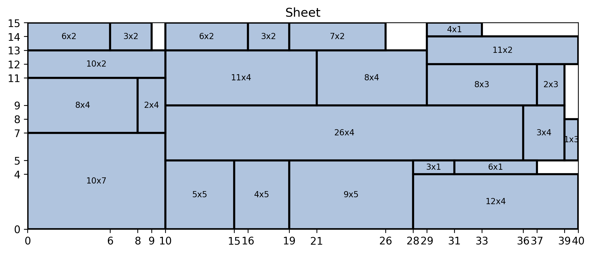

# 2D Cutting Problem

This project aims to solve the 2D Cutting Problem using Python. The 2D Cutting Problem involves cutting rectangular pieces from larger rectangular sheets in the most efficient way possible, minimizing waste.

This project was developed as part of the course [KOM4991 - Çok Disiplinli Tasarım Projesi / Multidisciplinary Design Project](http://www.bologna.yildiz.edu.tr/index.php?r=course/view&id=9699&aid=3&pid=196) at Yildiz Technical University.

## Table of Contents

- [Introduction](#introduction)
- [Installation](#installation)
- [Usage](#usage)
- [Algorithm](#algorithm)
- [Examples](#examples)
- [References](#references)
- [License](#license)

## Introduction

In the 2D Cutting Problem, we are given a set of rectangular pieces and a set of larger rectangular sheets. The goal is to find the optimal way to cut the pieces from the sheets, minimizing waste and maximizing the utilization of the sheets.

This project provides a Python implementation of an algorithm to solve the 2D Cutting Problem.

## Installation

To use this project, you need to have Python installed.

Additionaly, If you want to try out `notebook.ipynb` you should have `ipython` package installed.

## Usage

To generate the benchmark results, run `benchmark.py`:

```bash
python benchmark.py
```

and check the results in the `output/` directory.

<!-- ## Algorithm -->

## Examples



## References

- [ALGORITHMS FOR THE TWO DIMENSIONAL BIN PACKING PROBLEM WITH PARTIAL CONFLICTS](http://www.numdam.org/article/RO_2012__46_1_41_0.pdf)

## License

MIT
